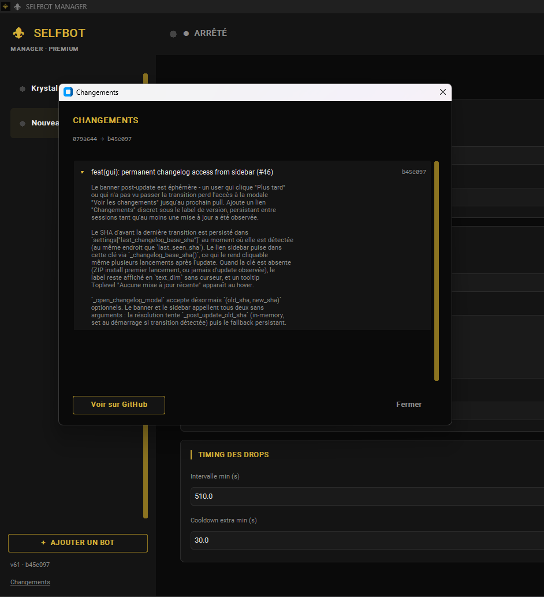
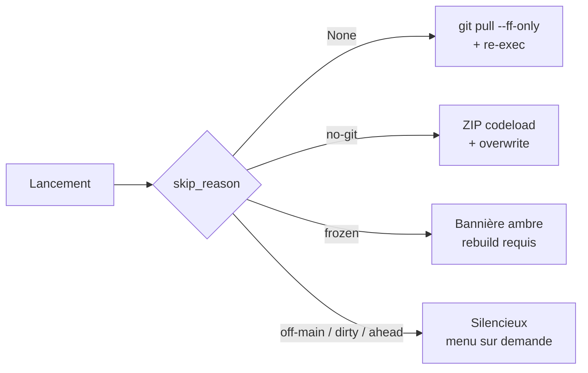

<div align="center">


<p>
  <a href="README.md">English</a> ·
  <a href="README.fr.md"><b>Français</b></a>
</p>

<p><i>Interface premium black &amp; gold pour orchestrer plusieurs selfbots Discord SOFI en parallèle.</i></p>

<p>
  <a href="https://github.com/Soma-Yukihira/sofi-manager/actions/workflows/ci.yml"></a>
  <a href="https://codecov.io/gh/Soma-Yukihira/sofi-manager"></a>
  
  
  
  
</p>

</div>

> [!WARNING]
> **Les selfbots violent les [Conditions d'utilisation Discord](https://discord.com/terms).**
> Utiliser ce projet sur ton compte peut entraîner une suspension ou un bannissement définitif.
> Ce projet est fourni à titre éducatif — **à tes risques et périls**.

---

## ✨ Fonctionnalités

- 🪶 **Multi-bot** — gère plusieurs selfbots depuis une seule fenêtre, chacun avec son thread, sa boucle asyncio et sa config
- 🎴 **Sélection intelligente** — scoring rareté + popularité avec override wishlist (personnages & séries)
- 🌙 **Pause nocturne** — fenêtre de sommeil aléatoire entre 22h et 01h pour imiter un humain
- 🌍 **Détection SOFI multilingue** — messages drop & cooldown analysés en **français et anglais**
- 🎨 **Thèmes premium** — presets sombre et clair + personnalisation couleur par couleur (17 slots)
- 📜 **Logs en direct** — console colorée par bot avec un flux diagnostic de tous les messages SOFI reçus
- 💾 **Local first** — config sur disque dans `bots.json` ; tokens chiffrés (Fernet) avec une clé stockée dans le keyring OS (fallback fichier sous `%APPDATA%/sofi-manager/`)

---

## 📸 Captures d'écran

|                                 |                                |
| :-----------------------------: | :----------------------------: |
|  |  |
| _Preset sombre_                 | _Preset clair_                 |

<div align="center">



_Modale changelog intégrée — corps de commit rendu en markdown léger entre deux SHA_

</div>

---

## 🚀 Démarrage rapide

```bash
git clone https://github.com/Soma-Yukihira/sofi-manager.git
cd sofi-manager
python -m venv env
# Windows
.\env\Scripts\activate
# macOS / Linux
# source env/bin/activate

pip install -r requirements.txt
python main.py
```

L'interface s'ouvre. Clique **+ AJOUTER UN BOT**, remplis ton token + drop channel, **Sauvegarder**, puis **▶ Démarrer**.

### Optionnel · .exe Windows autonome

Évite l'install Python avec un build en une commande :

```bash
python tools/build.py
```

Produit `dist/SelfbotManager/SelfbotManager.exe` — double-clic pour
lancer. Voir la page wiki [Compilation](../../wiki/Building-fr) pour les
options (`--onefile`, `--clean`) et la stratégie de chemins runtime.

### Optionnel · Épingler à la barre des tâches (Windows)

```bash
python tools/create_shortcut.py
```

Génère `Selfbot Manager.lnk` avec l'icône ⚜ dorée — pointe automatique
sur le `.exe` si tu en as compilé un, sinon sur le `pythonw.exe` du
venv. Glisse-le sur la barre des tâches (ou clic droit → *Épingler à la
barre des tâches*) — l'app se lance sans fenêtre de console.

### Mettre à jour

**Auto-update façon Discord (clones git).** Au démarrage, l'app vérifie
`origin/main` dans un thread d'arrière-plan. Quand de nouveaux commits
arrivent, un bandeau doré apparaît en haut de la fenêtre : *Mise à jour
disponible — Redémarrez pour appliquer*. Un clic sur **Redémarrer**,
l'app applique `git pull --ff-only`, relance Python, et le nouveau code
tourne. Pas de fichier de release, pas d'étape manuelle — chaque commit
sur `main` est une release.

L'auto-updater s'adapte à ton install :
- **Clone git** — `git pull --ff-only origin main` puis re-exec.
- **Téléchargement ZIP** (pas de `.git/`) — récupère `main` depuis
  `codeload.github.com` et écrase les fichiers suivis en place. Même
  bandeau, même flux de redémarrage.
- **`.exe` gelé** — désactivé ; un bandeau ambre passif renvoie vers
  un rebuild depuis un clone frais.
- Également désactivé sur une branche autre que `main`, avec des
  commits locaux en avance, ou des fichiers suivis modifiés.
- `bots.json`, `settings.json` et `grabs.db` sont gitignorés — ils
  survivent à chaque update intacts.

**Update manuel** (résumé verbeux en CLI, utile aussi sur VPS) :

```bash
python tools/update.py
```

Même commande sur Windows, macOS et Linux. Rafraîchit les dépendances
Python si `requirements.txt` a changé et imprime un résumé propre.

### Headless / VPS

Pour les serveurs sans écran, un CLI partage le même `bots.json` et le
même cœur :

```bash
python cli.py add                     # wizard interactif
python cli.py list                    # liste les bots configurés
python cli.py run                     # lance tout au premier plan
sudo ./tools/install-systemd.sh       # installateur systemd clé en main
```

Voir la [page wiki Déploiement VPS](../../wiki/VPS-Deployment-fr) pour le
guide complet, incluant `tmux`, hardening `systemd`, et push de la config
depuis le GUI vers le serveur.

📖 **Documentation complète dans le [Wiki](../../wiki).**

---

## 📂 Structure du projet

```
sofi-manager/
├── main.py              # Shim de lancement GUI (hook update pré-import)
├── cli.py               # Shim de lancement headless / VPS
├── sofi_manager/        # Package runtime — tous les modules réellement chargés
│   ├── gui.py           #   UI CustomTkinter + thèmes + bandeau update
│   ├── cli.py           #   Sous-commandes CLI (list / show / add / rm / run)
│   ├── bot_core.py      #   Classe SelfBot + orchestration
│   ├── parsing.py       #   Parseurs messages SOFI (FR + EN, purs)
│   ├── scoring.py       #   Scoring cartes + override wishlist (pur)
│   ├── crypto.py        #   Chiffrement Fernet des tokens (keyring OS)
│   ├── paths.py         #   Résolution bundle_dir() / user_dir()
│   ├── storage.py       #   Historique SQLite + migration legacy DB
│   ├── updater.py       #   Auto-updater git + ZIP-codeload
│   └── _migrations.py   #   Cleanup one-shot des .py root pre-refactor
├── selfbot-manager.spec # Spec PyInstaller (piloté par tools/build.py)
├── tools/               # build / update / shortcut / installeur systemd
├── assets/app.ico       # Icône ⚜ dorée, embarquée dans le .exe
├── requirements.txt     # discord.py-self, customtkinter, curl_cffi
├── tests/               # tests unitaires pytest
├── docs/
│   ├── wiki/            # Sources des pages wiki (EN + FR, sync auto vers GitHub Wiki)
│   └── images/          # Bannière + captures
└── LICENSE              # MIT
```

Les fichiers runtime `bots.json` (tokens chiffrés + configs bot),
`settings.json` (préférences thème + état updater) et `grabs.db`
(historique SQLite des grabs) sont créés au premier lancement et
gitignorés.

---

## 📚 Documentation

Le [Wiki](../../wiki) couvre chaque sujet en détail :

| Page | Contenu |
| ---- | ------- |
| [Installation](../../wiki/Installation-fr) | Setup Python, venv, dépendances |
| [Compilation](../../wiki/Building-fr) | .exe Windows autonome en une commande |
| [Configuration](../../wiki/Configuration-fr) | Chaque champ du GUI expliqué |
| [Thèmes](../../wiki/Theming-fr) | Presets et personnalisation 17 couleurs |
| [Mise à jour](../../wiki/Updating-fr) | Updater intégré, fallback ZIP, garde-fous |
| [Déploiement VPS](../../wiki/VPS-Deployment-fr) | CLI, `tmux`, hardening `systemd` |
| [Architecture](../../wiki/Architecture-fr) | Comment bots, threads et event loops sont câblés |
| [Dépannage](../../wiki/Troubleshooting-fr) | Erreurs courantes + log debug `📥 SOFI:` |
| [Avis ToS Discord](../../wiki/Discord-ToS-fr) | Risques et conséquences possibles |

---

## 🔧 Coulisses techniques

Quelques pièces non triviales à signaler si tu parcours le code :

- **Auto-updater 3 formes** — un seul classifieur `skip_reason()` route les
  clones git (`git pull --ff-only` + re-exec), les installs ZIP (codeload +
  écrasement en place, garde anti zip-slip) et les builds `.exe` figés
  (bannière ambre passive) à travers la même UI. Les baselines persistent
  dans `settings.json`.
- **Version dérivée de git, sans bump manuel** —
  `sofi_manager/version.py` construit un triplet `v<count> · <sha> · <date>`
  via `git rev-list` / `git log` au runtime, avec un `_build_info.py`
  généré au build PyInstaller et un troisième fallback pour les ZIP.
- **Modale changelog intégrée** — la bannière post-update ouvre une liste
  scrollable des commits entre l'ancien et le nouveau SHA, récupérés via
  l'API GitHub Compare et rendus en markdown léger (titres, puces,
  paragraphes wrap). Un lien sidebar la rouvre à tout moment.
- **Stockage chiffré des tokens** — Fernet, clé dans le keyring OS avec
  fallback fichier sous `%APPDATA%/sofi-manager/`. Les tokens en clair
  pré-existants sont migrés à la première sauvegarde.
- **Parser SOFI multilingue** — helpers regex purs dans
  [`parsing.py`](sofi_manager/parsing.py) qui reconnaissent le français
  (`drop des cartes`) et l'anglais (`dropping cards`) pour les drops et
  cooldowns. ~100% de couverture, aucune I/O.

### Flux de mise à jour



Le chemin git est strictement fast-forward et refuse de toucher au tree
sur une branche autre que `main`, avec des commits locaux d'avance, ou
avec des modifications non committées. Voir [Mise à jour](../../wiki/Updating-fr)
pour le flux côté utilisateur et [Architecture](../../wiki/Architecture-fr)
pour le threading et le pipeline drop.

---

## 🤝 Contribuer

Les PR sont les bienvenues. Lis [CONTRIBUTING.fr.md](CONTRIBUTING.fr.md) avant d'en ouvrir une.

Pour un bug, ouvre une [issue](../../issues/new) en y collant les lignes
`📥 SOFI:` de ton run — elles pointent immédiatement les changements de
format côté SOFI.

---

## 📄 Licence

[MIT](LICENSE) © Soma-Yukihira.

Ce logiciel est fourni "tel quel", sans garantie d'aucune sorte. En l'utilisant,
tu reconnais les risques décrits dans l'avertissement ci-dessus.
