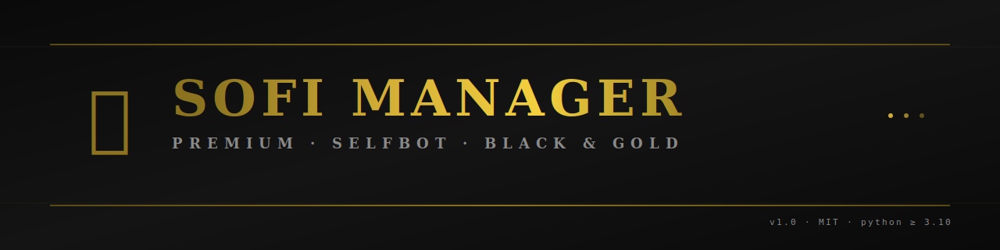
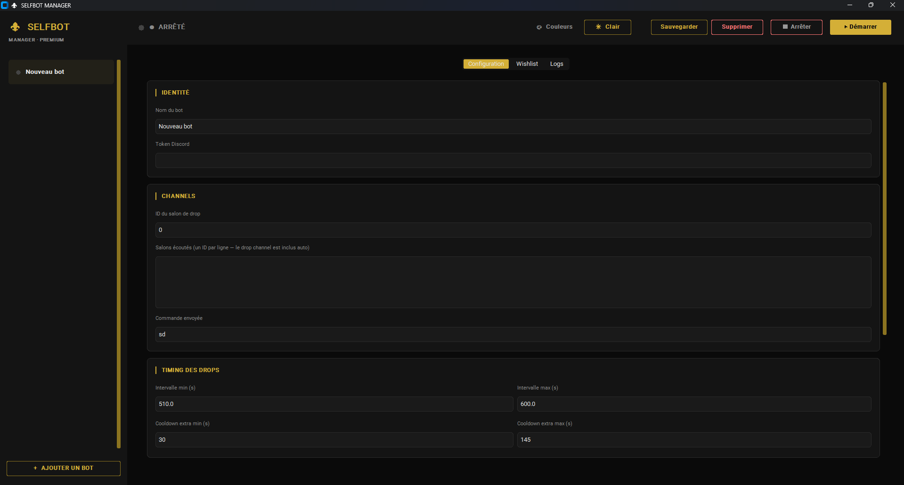
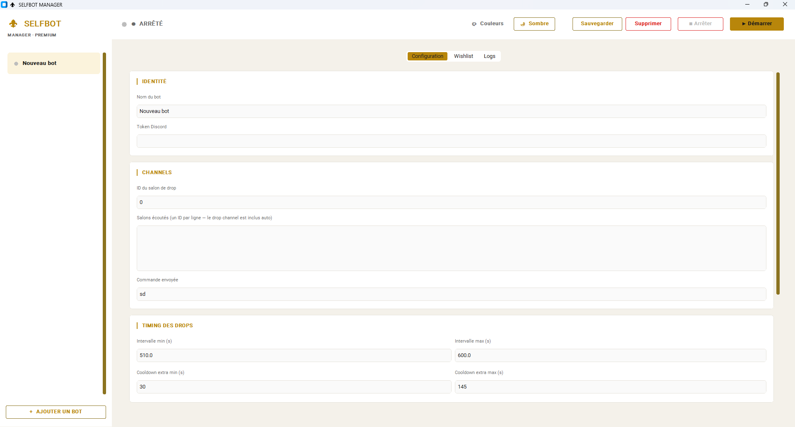

<div align="center">



<p>
  <a href="README.md"><b>English</b></a> ·
  <a href="README.fr.md">Français</a>
</p>

<p><i>Premium black &amp; gold GUI to orchestrate multiple Discord SOFI selfbots in parallel.</i></p>

<p>
  
  
  
  
</p>

</div>

> [!WARNING]
> **Selfbots violate the [Discord Terms of Service](https://discord.com/terms).**
> Running this on your account may result in suspension or permanent ban.
> This project is provided for educational purposes only — **use at your own risk**.

---

## ✨ Features

- 🪶 **Multi-bot** — manage any number of selfbots from a single window, each with its own thread, asyncio loop and config
- 🎴 **Smart card picking** — rarity + popularity scoring with wishlist override (characters & series)
- 🌙 **Night pause** — random sleep window between 22:00 and 01:00 to mimic human behavior
- 🌍 **Multilingual SOFI detection** — drop & cooldown messages parsed in **French and English**
- 🎨 **Premium theming** — dark and light presets + per-color customization (17 slots)
- 📜 **Live logs** — color-coded console per bot, with a diagnostic feed of every SOFI message received
- 💾 **Local-first** — config and tokens stay on disk in `bots.json`, never sent anywhere

---

## 📸 Screenshots

|                                 |                                |
| :-----------------------------: | :----------------------------: |
|  |  |
| _Dark preset_                   | _Light preset_                 |

---

## 🚀 Quick start

```bash
git clone https://github.com/Soma-Yukihira/sofi-manager.git
cd sofi-manager
python -m venv env
# Windows
.\env\Scripts\Activate.ps1
# macOS / Linux
# source env/bin/activate

pip install -r requirements.txt
python main.py
```

The GUI opens. Click **+ ADD BOT**, fill in your token + drop channel, **Save**, then **▶ Start**.

### Optional · Standalone Windows .exe

Skip Python entirely with a one-command build:

```bash
python tools/build.py
```

Produces `dist/SelfbotManager/SelfbotManager.exe` — double-click to run.
See the [Building](../../wiki/Building) wiki page for options
(`--onefile`, `--clean`) and runtime path strategy.

### Optional · Pin to taskbar (Windows)

```bash
python tools/create_shortcut.py
```

Generates `Selfbot Manager.lnk` with the gold ⚜ icon, auto-pointing at
the `.exe` if you built one, otherwise at the venv `pythonw.exe`. Drag
it onto your taskbar (or right-click → *Pin to taskbar*) — launches the
app without a console window.

### Updating

**Discord-style auto-update (git clones).** On startup the app checks
`origin/main` in a background thread. When new commits land, a gold
banner appears at the top of the window: *Mise à jour disponible —
Redémarrez pour appliquer*. Click **Redémarrer** and the app applies
`git pull --ff-only`, re-execs Python, and you are running the new
code. No release file, no manual step — every commit on `main` is a
release.

The auto-updater stays out of your way:
- Skips entirely when `.git/` is absent (ZIP / `.exe` installs).
- Skips when you have local commits ahead of `origin/main`, or
  uncommitted changes to tracked files.
- Your `bots.json` and `settings.json` are gitignored, so they survive
  every update untouched.

**Manual update** (verbose CLI summary, also useful on a VPS):

```bash
python tools/update.py
```

Same command on Windows, macOS, and Linux. Refreshes Python deps if
`requirements.txt` changed and prints a clean diff summary.

### Headless / VPS

For servers without a display, a CLI shares the same `bots.json` and core:

```bash
python cli.py add                     # interactive bot wizard
python cli.py list                    # show configured bots
python cli.py run                     # run all in the foreground
sudo ./tools/install-systemd.sh       # one-shot systemd service installer
```

See the [VPS Deployment wiki page](../../wiki/VPS-Deployment) for the full
guide, including `tmux`, `systemd` hardening, and pushing config from the
GUI to the server.

📖 **Full documentation in the [Wiki](../../wiki).**

---

## 📂 Project structure

```
sofi-manager/
├── main.py              # GUI launcher
├── cli.py               # Headless / VPS launcher (same core)
├── gui.py               # CustomTkinter interface + theme system
├── bot_core.py          # SelfBot class + parsing/scoring logic
├── tools/               # update / install-shortcut / install-systemd
├── requirements.txt     # discord.py-self, customtkinter
├── tests/               # lightweight core unit tests
├── docs/
│   ├── wiki/            # Wiki source pages (EN + FR)
│   └── images/          # Banner + screenshots
└── LICENSE              # MIT
```

The runtime files `bots.json` (tokens) and `settings.json` (theme prefs) are
created on first use and gitignored.

---

## 📚 Documentation

The [Wiki](../../wiki) covers each topic in depth:

| Page | What's inside |
| ---- | ------------- |
| [Installation](../../wiki/Installation) | Python setup, venv, dependencies |
| [Building](../../wiki/Building) | One-command standalone Windows .exe |
| [Configuration](../../wiki/Configuration) | Every field of the GUI explained |
| [Theming](../../wiki/Theming) | Presets and 17-slot color customization |
| [Architecture](../../wiki/Architecture) | How bots, threads and event loops are wired |
| [Troubleshooting](../../wiki/Troubleshooting) | Common errors + the `📥 SOFI:` debug log |
| [Discord ToS Notice](../../wiki/Discord-ToS) | Risks and what to expect |

---

## 🤝 Contributing

PRs are welcome. Read [CONTRIBUTING.md](CONTRIBUTING.md) before opening one.

For bugs, open an [issue](../../issues/new) with the `📥 SOFI:` log lines from
your run — they pinpoint format changes on SOFI's side instantly.

---

## 📄 License

[MIT](LICENSE) © Soma-Yukihira.

This software is provided "as is", without warranty of any kind. By using it,
you acknowledge the risks described in the warning above.
